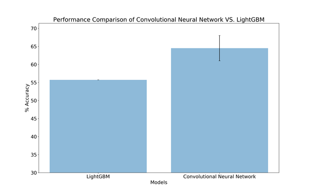
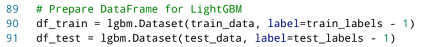
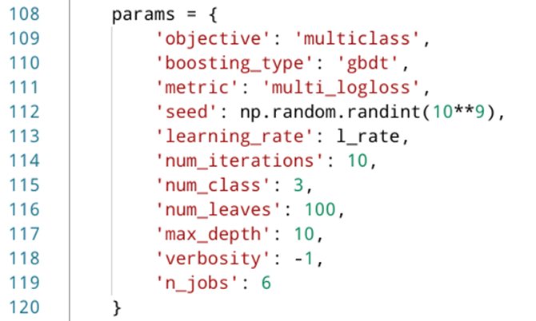
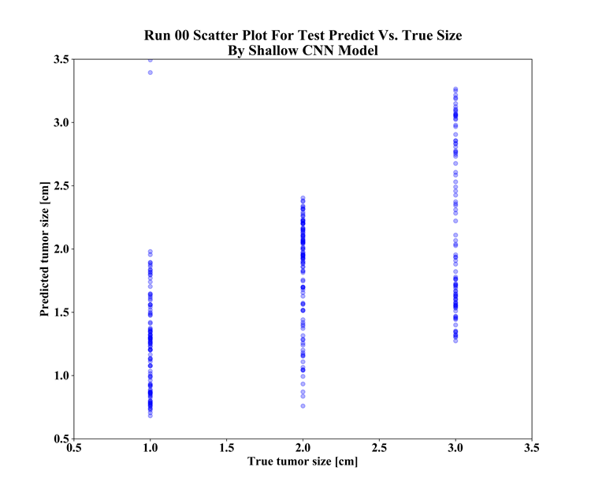
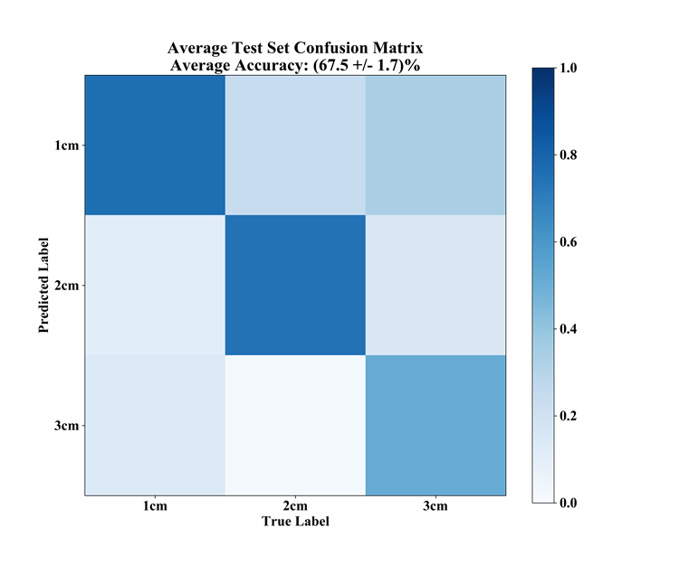
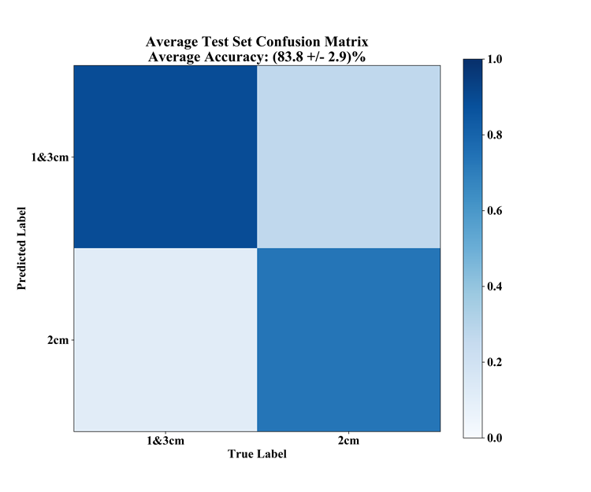
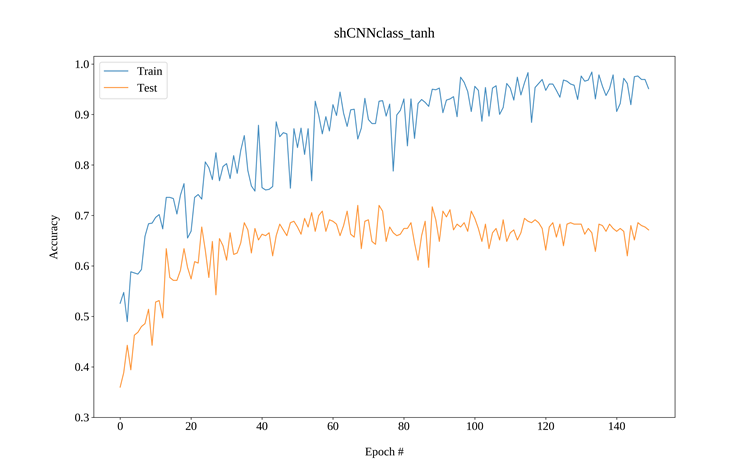
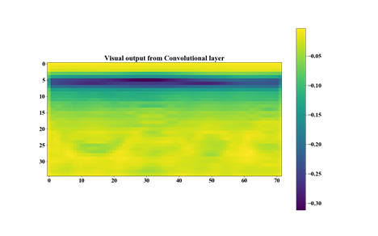
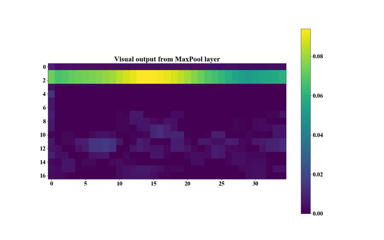
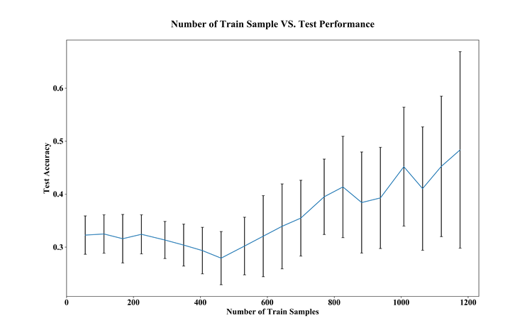

# Expanding Diagnosis Ability to Predict Tumour Size Using Convolutional Neural Networks

In this post I will go over a few problems while working on the project in the Physics Department at the University of Manitoba.

Before taking you through the tasks completed towards the project, let's go over what was the purpose of this project.

Microwave and millimetre waves have been used extensively to image dielectric bodies of material. More recently, microwave and millimetre-wave systems have been deployed for a variety of short-range applications, most notably in concealed weapon detection, through-the-wall imaging, and nondestructive testing for structural integrity. The application of microwaves in biomedical imaging and diagnostics, however, remains a relatively unexplored field.

Currently, breast cancer often requires invasive biopsies for diagnosis, motivating researchers to design and develop non-invasive and automated diagnosis systems. The early detection of breast cancer is pivotal to ensure successful treatment. Microwave systems offer the possibility of a complementary modality to the current standard of X-ray mammography for breast cancer screening. These systems offer the advantage of pain-free non-ionizing scans. The ability to create affordable microwave systems would allow for scans to be easily available to an increased number of women; additionally, the non-ionizing nature of the scan enables the possibility of more frequent exams.

Machine learning algorithms can be applied to data obtained from microwave systems in order to classify and detect the presence of a tumor embedded within the breast. In my summer project I mainly worked with machine learning models and algorithms. Techniques were developed to investigate the performance of tumor size prediction in various breast densities and sizes. Many machine learning algorithms exist however Convolutional Neural Networks (CNN) were mainly used  to analyze the obtained scans.

CNNs are a category of Neural Networks that have proven very effective in areas such as image recognition and classification. They have been successful in identifying faces, objects and traffic signs apart from powering robots and self-driving cars.

There is a pressure in all industries to perform jobs with precision, accuracy and efficiency. Very few careers are as unforgiving as those in the medical industry as medical misdiagnosis can create a life-or-death situation. Some areas of medicine are more impacted than others by new technologies. Based on learned patterns, a machine learning algorithm can diagnose a patient with higher precision and accuracy comparing to a human radiologist. This can prevent or at least reduce misdiagnosis in difficult cases. Needless to say, a human radiologist is more expensive and not as efficient. Sorry for throwing radiologist under the bus!

In our lab, the challenges in tumour size detection were due to limited number of samples in data-set, and relatively indistinctive images obtained from the microwave bed system. The next steps in improving the performance of the algorithm were: expansion in number of samples in the current data-set and implementing of more sophisticated model architectures

A few machine learning literatures were reviewed. Particularly, algorithms such as LightGBM, K-Nearest Neighbour, and CNNs were investigated. The provided code was reviewed, and data was visualized with Python using the *matplotlib* package. Training and test data-set were both 3-dimensional. This caused problems when building model architectures with LightGBM and Dense Neural Network (DNN). Later we reshaped the data-sets to 2-dimensions.

An attempt was made to classify classes using a decision tree model. LightGBM was used in this case and was predicted on the test data-set. This algorithm is gradient boosting framework that uses tree-based learning algorithms. The given data array was reduced from 3-dimensions to 2 dimensions. For example, an array of 163x100x72 is reshaped to 163x7200. The areas of interest were kept between indices 5 to 40 in the time domain. The process of reshaping was repeated with the above time window. LightGBM supports input data files with CSV, TSV, and LibSVM formats. During scripting, instead of other data formats, we generated LightGBM data-frames for both train and test sets (Fig. 1). LightGBM required parameters to fit the algorithm in the training data. Parameters can be passed as a Python dictionary (Fig. 2). For more information on descriptions of all parameters refer to this [this page](https://lightgbm.readthedocs.io/en/latest/Parameters.html).

Fig. 1 - LightGBM data-frame.

Fig. 2 - LightGBM parameter dictionary.

The first data acquisition process started from the bed system in the laboratory. The required chemical solutions were prepared to model the *in vitro* phantoms. The two chemicals used consisted of Glycerin and 30% Triton X1000. The adipose and the fibro-glandular shell were prepared and placed at the designated area on the bed system. The position of the phantom was secured using hot glue. Then, using PLANAR ACM8000T the radiating system on the bed was calibrated with a software made to interface with the bed system. A 3 cm tumour was placed inside the phantom at *X=2.25* and *Y=-2.25* cm according to the grid block resting on top of the phantom. After getting familiar with the process of scanning with the bed system, more scans were taken with different tumour positions. The data was retrieved and their validity was verified using a Python script.

A tumour size prediction was performed using the previously designed network architecture in the lab. This network was modified to serve as a regression network model. The metric used in this regression model is Mean Squared Error (MSE). Also, negative samples were removed from the data-set. Multiple optimizer functions were tested, however only two were promising. The two optimizer functions are Stochastic Gradient Descent (SGD) and Adam (a method of stochastic optimization). Table 1 and 2 show the average %MSE results of 10 iterations with 30 epochs:

| SGD           |          |         |             |
|---------------|:--------:|:-------:|:-----------:|
| Learning Rate |0.01      |0.001    |0.0001       |
| %MSE          |76 +/- 8  |75 +/- 3 |71.8 +/- 0.7 |

Table 1 - Average %MSE results using SGD.

#

| Adam            |          |          |          |
|-----------------|:--------:|:--------:|:--------:|
| Learning Rate   | 0.01     | 0.001    | 0.0001   |
| %MSE            | 75 +/- 6 | 84 +/- 5 | 81 +/- 2 |

Table 2 - Average %MSE results using Adam.

#

Next, a plan was scheduled to add 47 more scans to the current 203-sample data-set. Table 3 shows the plan for each day. The name coding A#F# indicates Adipose layer (A) followed with a number indicating the size of it, and fibro-glandular shell (F) followed with a number indicating the size of it. Positive and negative samples are indicated by POS and NEG where positive samples are followed by the diameter size of the lump inserted.

| Day 1              | Day 2              | Day 3              |
|:------------------:|:------------------:|:------------------:|
| *CALIBRATE*        | *CALIBRATE*        | *CALIBRATE*        |
| 2 x A2F4, NEG      | 2 x A3F3, POS 3 cm | 3 x A2F5, POS 2 cm |
| 3 x A2F1, NEG      | 3 x A3F3, NEG      | 4 x A2F5, NEG      |
| A2, REF            | A3, REF            | A2, REF            |
| EMPTY CHAMBER      | EMPTY CHAMBER      | EMPTY CHAMBER      |
| 1 x A2F1, POS 2 cm | 2 x A3F3, POS 2 cm | 3 x A1F4, POS 2 cm |
| 4 x A2F1, POS 1 cm | 2 x A3F5, NEG      | 4 x A1F4, NEG      |
| A2, REF            | A3, REF            | A1, REF            |
| *CALIBRATE*        | *CALIBRATE*        |                    |
| 4 x A2F1, POS 1 cm | 5 x A3F1, POS 2 cm |                    |
| 1 x A2F1, NEG      | A3, REF            |                    |
| A2, REF            | EMPTY CHAMBER      |                    |
| EMPTY CHAMBER      | 4 x A3F1, NEG      |                    |
|                    | A3, REF            |                    |

Table 3 - Scan plan for 47 new samples.

 

Fig 3 - Adipose and Fibro-glandular Shells.

 

Fig 4 - Bulbs Acting as Lumps Inside the Phantom.

#

The newly obtained data was processed and brought into the time domain. After merging the two data-sets (the old and the new), the total number of samples reached to 250 with even distribution of positive and negative samples. Next, a unique test-set was generated to avoid data contamination during training of the model. The new test-set was generated manually, where all samples are unique and do not repeat in the the train-set.

The newly generated data-set was applied to the shallow CNN regression model. The average %MSE over 30 iteration was (86 +/- 10)%. Figure 5 shows the prediction result of the regression model on the augmented test-set.

Fig. 5 - Prediction Result of the Regression Model on the Augmented Test-set.

To gain more insight into the behaviour of the model and data-set, classification was used instead of regression. *Tensorboard* was used to record learning behaviour of the models. Confusion matrices were generated to better visualize the number of false-positives and true-positives in the classifications. Different classification architectures were used, and data augmentation techniques were applied to both train and test set. The best classification performance belongs to the Hybrid CNN model architecture with an accuracy of (68 +/- 2)%. The Hybrid CNN model does not use a sequential method. This architecture consists of two input branches where one branch receives the training data set and the other branch receives extra features that were manually selected. Figure 6 shows the confusion matrix graph of the Hybrid CNN model:

Fig. 6 - Average Accuracy of Hybrid Shallow CNN Augmented Confusion Matrix.

#

At this stage the decision was made to unite two of the classes out of the three-class problem. This was done just for the sake of finding out if the model architecture is faulty or the data-set needs more processing. The data from two of the classes were combined to create single classes named: 1&2, 1&3, and 2&3. Therefore, the problem became a binary classification problem considering only two classes. For example, 1&2 and 3 were considered as a binary classification case. Same data augmentation techniques were applied to the train and test set. The average accuracy with united 1&3 class using shallow CNN was (84 +/- 3)%. Figure 7 shows the confusion matrix of the united 1&3 class using the shallow CNN model:

Fig. 7 - Average Accuracy on Augmented Test Set with United 1&3 Classes Using Shallow CNN Model.

#

There are two ways to visualize the learning curves obtained from *tensorboard*. One way is to execute the *tensorboard* web interface within the directory where the callback files reside. The *tensorboard* web interface has a good visualizing tools. The other way is to obtain CSV files through the web interface and plot them using Python. Figure 8 shows an example of Python generated learning curve. We can observe that after a certain number of epochs the learning curve of the test set does not follow the train set. This means that our model stopped learning any unique features from the given data after about 60 epochs.

In order to run the web interface, you must execute the following command in terminal:

`$ tensorboard --logdir {directory that contains the callback files}`

Fig. 8 - Matplotlib generated plot using CSV data extracted from tensorboard.

The above result is an indication that the model is no longer learning from the data. Hence, further investigation is required to discover why.

#

Next, the output of the filters inside the CNN layers were visualized. First, the output from the activation function layer was visualized. And finally, the output of the MaxPool layer was visualized. By investigating these visuals, it was discovered that a few filter outputs have no information at all (i.e. a matrix of zeros). The reason for this anomaly was the ReLU activation function that set the negative values in the convolved matrix to zeros. Therefore, to make sure that the negative values from filters propagate forward, the Hyperbolic Tangent was used as the activation function from then on. Figures 9, 10, and 11 show the output of the various layers in the CNN model. This visualization was successfully done with the help of the available documentation on [this page](https://keras.io/).

Fig. 9 - Output from Conv2D layer.

Fig. 10 - Output from ReLU activation layer.

Fig. 11 - Output from MaxPool2D layer.

#

Finally, a graph was visualized that represents the test set accuracy versus the number of samples in train set. This graph shows how test accuracy performs as the number of samples are increased in the train set. This was done in 20 steps of 50 iterations. In each iteration the entire data set is shuffled, and the distribution of 2 cm tumour sizes were flattened. Figure 10 shows the behaviour of the test set accuracy as we increase the train set samples. Note that by increasing the samples in train set the number of samples in test set decreases proportionally.

Fig. 10 - Graph of test set accuracy versus number of train set samples.

#
# Challenges and how to face them

Some of the challenges faced were finding the appropriate number of epochs for the models, generating meaningful plots and graphs, and scripting new functions to perform a specific task on the data set. For example, we had to write a function to flatten the distribution of all tumour sizes in the targeted data set.

# Future Work

To improve the performance of the model network, the number of samples in the data set must be increased. Also, we must make sure there is enough variation in the given data set. Another approach is to create a multi-dimensional data set where each sample has multiple channels of sinogram data. Theoretically, each channel can be dedicated to unique frequency sweeps. For example, first channel contains data from 1-3 GHz, second channel contains data from 3-6 GHz, and the third channel contains data from 6-8 GHz. The only drawback with this approach may be the extra time required to obtain a single scan.

